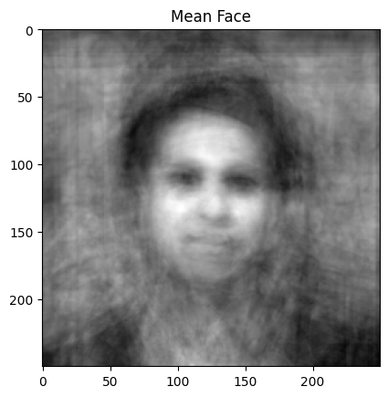
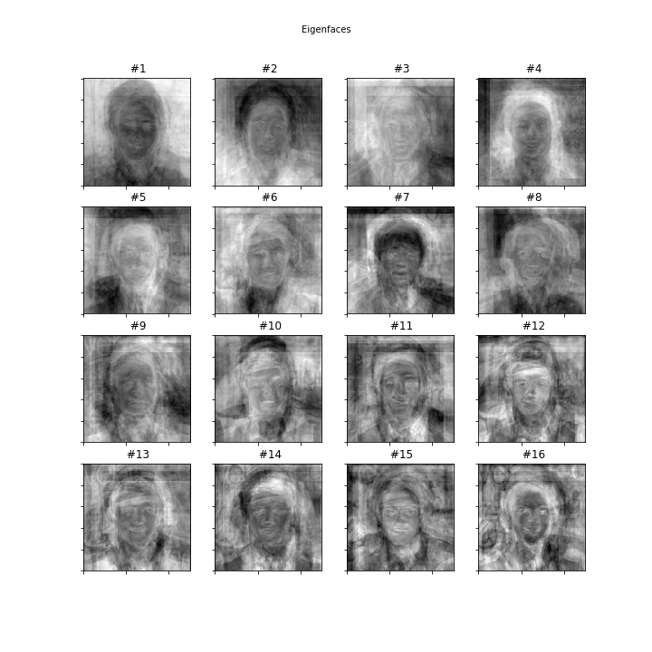
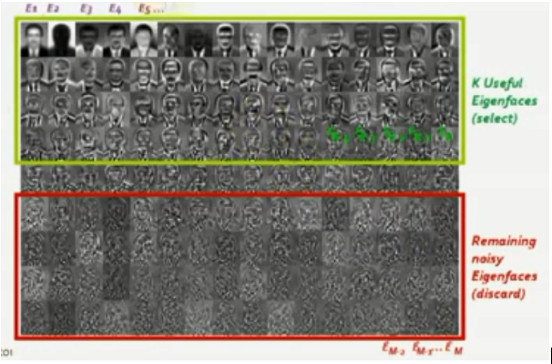
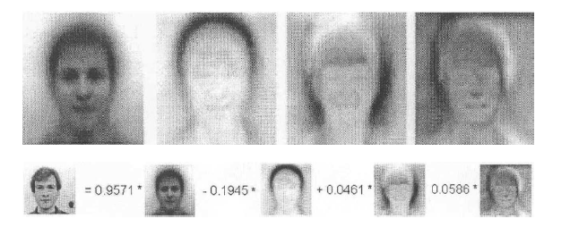
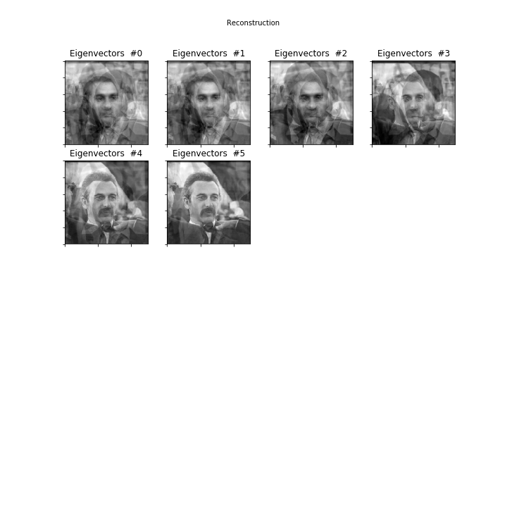
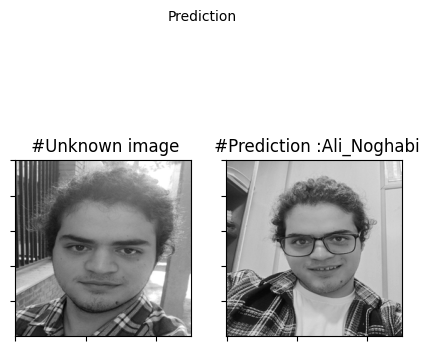

# Eigenfaces: Survey and Implementation from Scratch

## Abstract
The Eigenfaces method is used for face recognition by reducing the dimensionality of face images using Principal Component Analysis (PCA). This method identifies the components with the most information and captures the most variance. Each face is represented by a combination of eigenfaces, and recognition is performed by comparing the distances between these eigenfaces.

[colab notebook](https://colab.research.google.com/github/Ali-Noghabi/eigenfaces/blob/main/eigenfaces.ipynb)

## Overview

### Eigenfaces
Eigenfaces are eigenvectors of the covariance matrix of face images. They capture the variation in facial images and are used for efficient face recognition.

### Motivation
The goal is to extract facial information and represent it efficiently for reduced computation and storage.

### Principal Component Analysis (PCA)
PCA reduces correlated variables into a few uncorrelated ones, capturing the most variance. It is used to generate eigenfaces by analyzing a large set of face images.

## Implementation Steps

### 1. Read Images
Face images are read from a directory, converted to grayscale, resized, and stored as numpy arrays.

### 2. Assemble Data Matrix
Images are represented as vectors and assembled into a data matrix where each row represents one image.

### 3. Compute the Mean Face
Calculate the average image of the dataset.

### 4. Calculate PCA
Subtract the mean from each image, calculate the covariance matrix, and determine eigenvalues and eigenvectors and select k useful eigenfaces.

### 5. Representing Faces onto This Basis
Each face is represented as a linear combination of the eigenfaces.

### 6. Face Recognition
Recognition is performed by projecting all training samples and the query image into the PCA subspace and finding the nearest neighbor.

## Conclusion
The Eigenfaces method efficiently reduces the dimensionality of face images and performs recognition by comparing eigenfaces. Future work will focus on larger datasets and combining this method with other face recognition algorithms.

## References
1. [Eigenfaces](http://www.scholarpedia.org/article/Eigenfaces)
2. [Principal Component Analysis](https://en.wikipedia.org/wiki/Principal_component_analysis)
3. [Euclidean Distance](https://en.wikipedia.org/wiki/Euclidean_distance)
